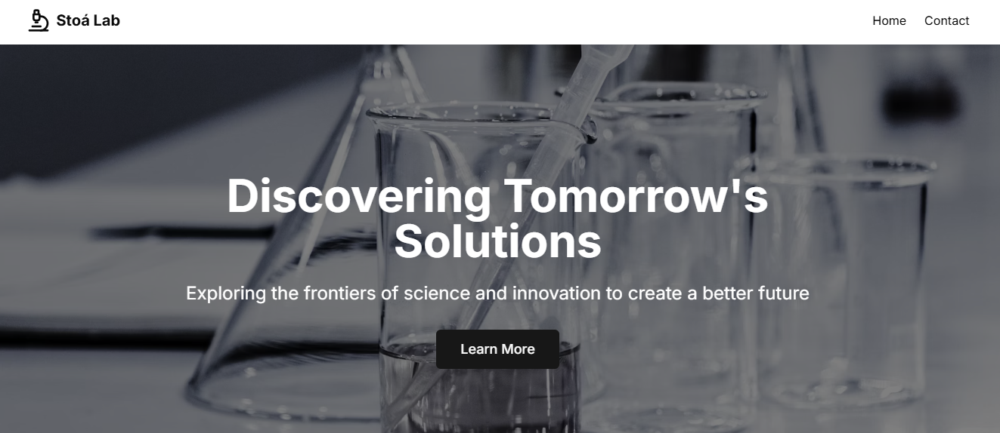
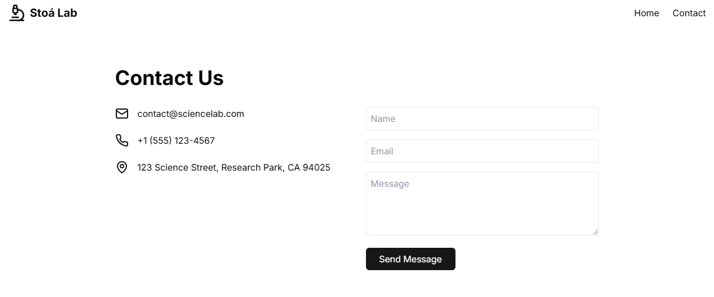

# 🚀 Science Landing Page

Welcome to the **Science Landing Page**, a modern and visually appealing project built with **React**, **Next.js**, and **Framer Motion**!  
🌌 This project showcases smooth animations, a responsive design, and a seamless user experience.

---

## 📸 Preview

> Project screenshots:

| Landing Page | Hero Section in Mobile | Contact Page |
|--------------|------------------------|--------------|
|  |  |  |

---

## 🎥 Video 

> Project preview:

---

## 🎯 Features

- **Next.js**: For server-side rendering, routing, and fast performance.
- **Framer Motion**: Smooth animations to bring your landing page to life.
- **Responsive Design**: Optimized for all devices, from desktops to mobile.
- **Tailwind CSS**: Utility-first styling for fast and efficient development.

---

## 🛠️ Technologies Used

- **React**: Frontend library for building user interfaces.
- **Next.js**: Framework for server-side rendering and routing.
- **Framer Motion**: Animation library for React.
- **Tailwind CSS**: Styling with utility-first classes.
- **Lucide Icons**: For beautiful and scalable icons.

---

## 🚀 Getting Started

Follow these steps to run the project locally:

1. **Clone the repository**:
git clone https://github.com/your-username/science-landing-page.git  
cd science-landing-page
   
2. **Install dependencies**:
npm install

3. **Run the development server**:
npm run dev

Visit http://localhost:3000 in your browser to view the landing page in action.
